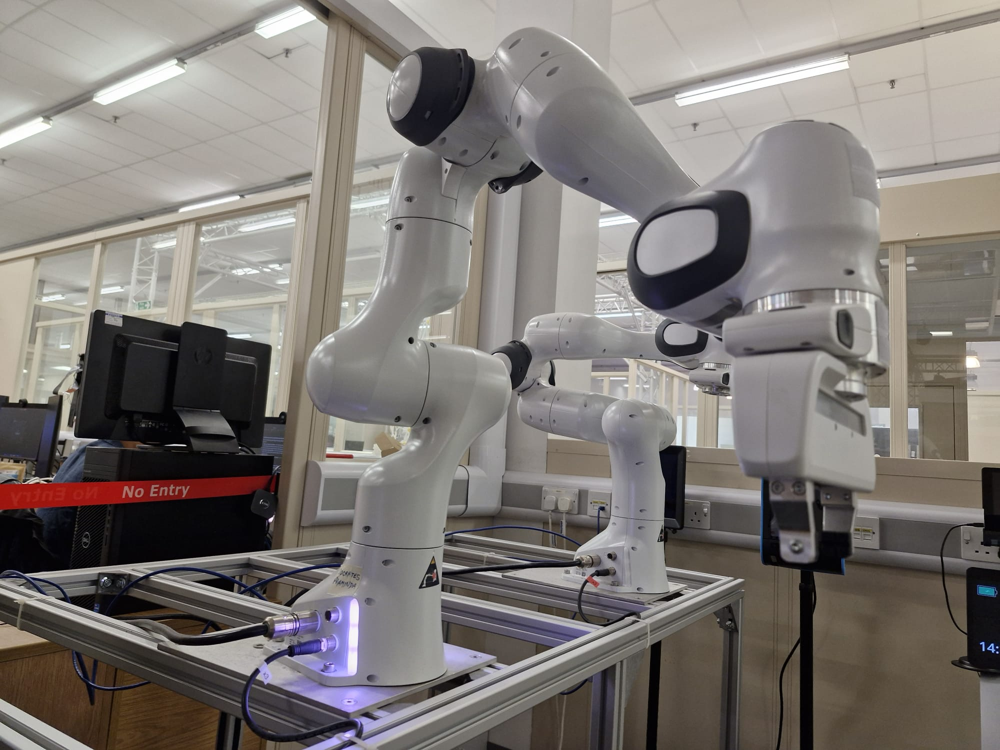
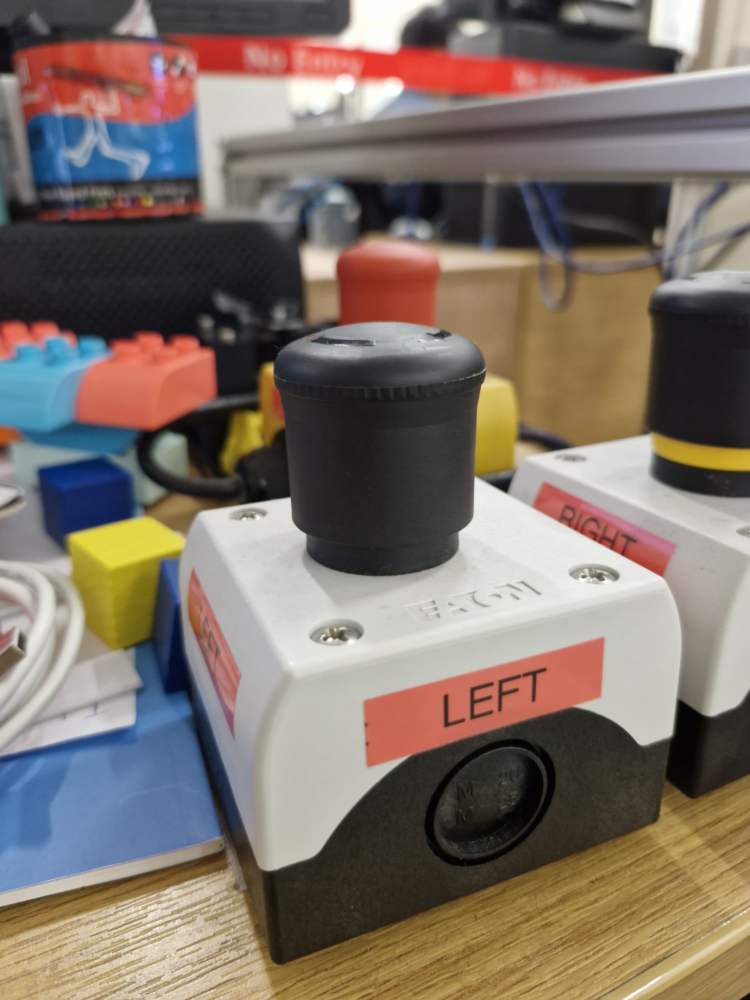

# Franka Robot Setup Guide




This guide provides step-by-step instructions for setting up and operating the Franka Emika robot using ROS (Robot Operating System) in a Docker environment.

## Prerequisites

- Ubuntu OS with RT (Real-Time) kernel support
- Docker and Docker Compose installed
- Ethernet connection to the Franka robot
- Basic knowledge of ROS and Docker
- Git installed

## Installation

Clone this repository and its submodules:

```bash
# Clone the main repository
git clone https://github.com/Om-Kulkarni/Franka_ROS_Setup.git

# Navigate to the repository
cd Franka_ROS_Setup

# Initialize and update submodules (franka_ros and panda_moveit_config)
git submodule update --init --recursive
```

## Setup Instructions

### 1. Real-Time Kernel Setup

For detailed instructions on installing and configuring the real-time kernel on Ubuntu, please refer to the [official Franka documentation Linux Installation Section](https://frankarobotics.github.io/docs/installation_linux.html).

Start by booting your computer with the real-time kernel:

1. During boot, press and hold the Shift key to access GRUB menu
2. Select "Advanced options for Ubuntu"


3. Choose the kernel version ending with "-rt" (real-time)


### 2. Hardware Setup

1. **Hardware Stop Check**
   - Ensure the hardware stop is unlocked
   - The yellow part beneath the red button should be visible
   
   

2. **Robot Controller**
   - Turn on the robot controller switch
   - You will hear the fans spinning
   - The robot will pulse yellow during startup
   - Wait until the pulsing stops, indicating startup completion

3. **Franka Software Switch**
   - Make sure the software switch is enabled in the Desk interface for robot operation
   

### 3. Network Configuration

1. **IP Address Setup**
   - Connect the ethernet cable between your computer and the robot
   - Check your ethernet settings' IPv4 section
   - Note the robot's IP address (typically 172.16.0.2)

   

2. **Desk Interface Access**
   - Open a web browser
   - Navigate to the Franka desk interface: `http://172.16.0.2`
   - You will need your Franka Desk Interface username and password to log in
   - Contact your system administrator or refer to your robot's documentation for the credentials
   - If needed, consult your robot's configuration documentation for the exact IP

### 4. Enable FCI (Franka Control Interface)

1. In the desk interface, activate the FCI
2. This step is crucial for ROS packages to communicate with the robot

   

## Running the Docker Environment

We provide both ROS 1 (Noetic) and ROS 2 (Humble) environments:

### Environment Customization

Before running the containers, you can customize the environment by editing the `docker-compose.yaml` file:

1. **Setting Robot IP Address**
   ```yaml
   environment:
     - LIBFRANKA_IP=172.16.0.2  # Replace with your robot's IP
   ```

2. **Mounting Custom Packages**
   Add your custom ROS packages by mounting them as volumes:
   ```yaml
   services:
     ros1-franka:
       volumes:
         - /tmp/.X11-unix:/tmp/.X11-unix:rw
         - ./my_custom_package:/catkin_ws/src/my_custom_package  # For ROS 1
     
     ros2-franka:
       volumes:
         - /tmp/.X11-unix:/tmp/.X11-unix:rw
         - ./my_custom_package:/ros2_ws/src/my_custom_package    # For ROS 2
   ```

### Starting the Containers

#### Ubuntu Setup
1. Allow X11 forwarding for GUI applications:
```bash
xhost +local:docker
```

### Starting the ROS 1 Environment
```bash
# Start the container in detached mode
docker compose up -d ros1-franka

# Access the running container
docker compose exec ros1-franka bash
```

### Starting the ROS 2 Environment
```bash
# Start the container in detached mode
docker compose up -d ros2-franka

# Access the running container
docker compose exec ros2-franka bash
```

To stop the containers:
```bash
docker compose down
```

If you've added custom packages, don't forget to build them inside the container:
```bash
# For ROS 1
catkin_make

# For ROS 2
colcon build
```

### Testing the Setup

After setting up the environment, you can verify that everything is working correctly by testing the gripper functionality:

#### Control the Robot via MoveIt
```bash
# Inside the ROS 1 container
roslaunch panda_moveit_config franka_control.launch robot_ip:=<your robot's ip>
```
This will launch the MoveIt control interface for the Franka robot. Replace `<your robot's ip>` with the actual IP address of your robot.


#### ROS 2
```bash
# Inside the ROS 2 container
ros2 launch franka_gripper gripper.launch.py robot_ip:=172.16.0.2  # Replace with your robot's IP
```

If you see error messages or no gripper feedback, check:
1. Robot IP address is correct
2. FCI is enabled in the desk interface
3. Network connection is stable
4. No other nodes are controlling the gripper

## Repository Structure

```
.
├── Docker/
│   ├── ros1/           # ROS 1 Noetic setup
│   ├── ros2/           # ROS 2 Humble setup
│   └── docker-compose.yaml
├── images/             # Setup guide images
└── README.md
```

## Troubleshooting

1. **No Real-Time Kernel**
   - Verify you're booted into the RT kernel: `uname -a`
   - Look for "PREEMPT_RT" in the output

2. **Cannot Connect to Robot**
   - Verify ethernet connection
   - Check IP address configuration
   - Ensure FCI is enabled in desk interface

3. **Docker Issues**
   - Ensure Docker service is running: `sudo systemctl status docker`
   - Verify user is in docker group: `groups`
   - Try running with sudo if needed

## Support

For additional support or issues:
- Create an issue in this repository
- Consult the [Franka Documentation](https://frankarobotics.github.io/docs/) 
